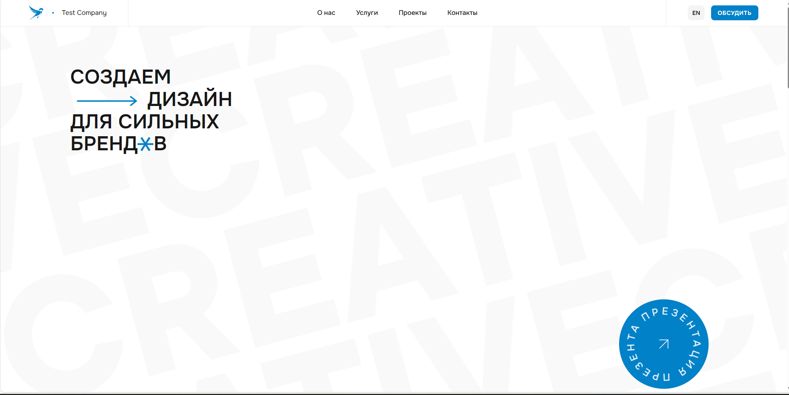
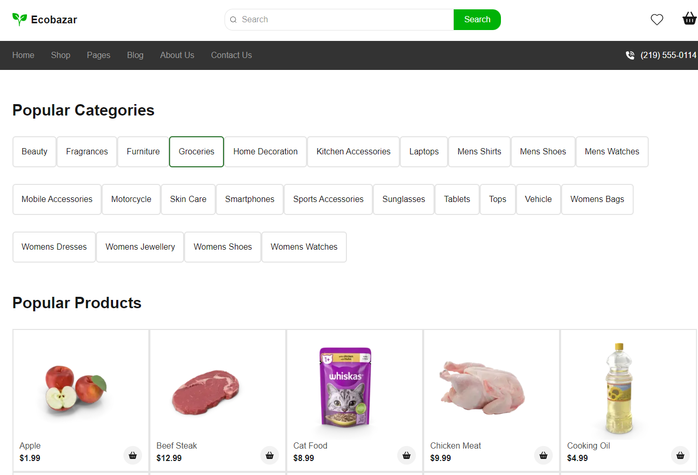

# Привет, я Анастасия 👋

Начинающий frontend-разработчик. Учусь верстать быстро, аккуратно и по BEM/адаптивно, постепенно перехожу на React-стек.

📧 Email: majpotejto@gmail.com
🐙 GitHub: [@joyl-script](https://github.com/joyl-script)

---

## 🚀 Проекты

### 1. Test Company — лендинг дизайн-агентства
Next.js + Tailwind: хиро-секция, бегущая строка с логотипами клиентов, карточки кейсов, блок услуг, футер с контактами.

📂 [Код](https://github.com/joyl-script/test-company) · 🌐 [Демо](https://test-company-umber.vercel.app)

---

### 2. Ecobazar — интернет-магазин эко-товаров
Next.js-приложение: каталог, карточки товаров, корзина.

📂 [Код](https://github.com/joyl-script/next-syte) · 🌐 [Демо](https://next-syte-z2q2-six.vercel.app/)

---

### 3. Kinopoisk clone — стриминг-платформа (лендинг)
hero-секция, модалки логина/регистрации, футер с соцсетями, переход через модалки на главную страницу с фильмами

📂 [Код](https://github.com/joyl-script/my-eight-syte) · 🌐 [Демо](https://joyl-script.github.io/my-eight-syte/)

---

## 🛠 Стек

`HTML5` `CSS3` `Sass/SCSS` `Tailwind` `JavaScript` `React` `Redux Toolkit` `TanStack Query` `Next.js` `Git & GitHub`

## 📫 Связаться со мной

- Email: majpotejto@gmail.com
- Telegram: [@Pqakwsij]

